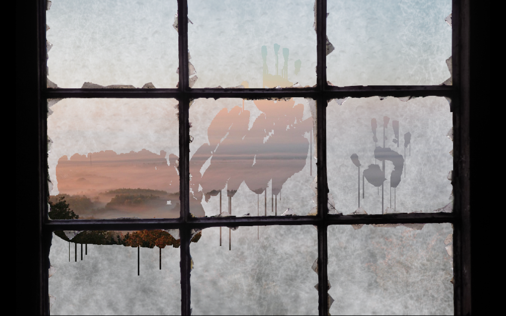

# Fogged Window demo for Mini Micro

Demo for the <a href="https://miniscript.org">Mini Micro</a> of a wiping a fogged window with the hand.

As one does so the picture "outside" (typically a beautiful landscape) is revealed.

This demo features the following aspects:

* Drawing a complex shape in form of many polygons
* Mask-erasing an image (the fogged glass) by "painting" with the clear color
* The usage of multiple layers in the form of pixel-displays to achieve the desired effect
* The handling of mouse-dragging when "wiping" over the window
* The subtle and continuous animation of the falling droplets

## Try out

Try out online on itch.io:

https://sebnozzi.itch.io/foggy-window

## Credits

Images taken from:

- https://pixabay.com/photos/morning-mood-autumn-morning-2954031/
- https://pixabay.com/de/photos/fenster-eisenfenster-glas-scheiben-2672740/
- https://pxhere.com/en/photo/849995
